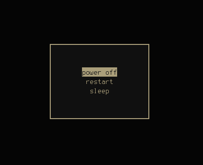

# Installation
```git clone https://github.com/909oce/powermenu-tui```
# Hyprland Example


hyprland.conf
```
bind = SUPER SHIFT, L, exec, pkill python || kitty --class powermenu -e python $scriptsDir/power/menu.py

windowrulev2 = float,class:(powermenu)
windowrulev2 = size 200 150,class:(powermenu)
windowrulev2= dimaround,class:(powermenu)
windowrulev2= center,class:(powermenu)
```
# Config
You can technically use this menu to run any command by editing `config.json`.

